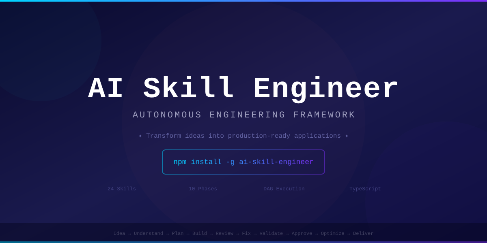

<picture>
  <source media="(prefers-color-scheme: dark)" srcset="media/banner.svg">
  
</picture>

<br>

<div align="center">

# AI Skill Engineer

> **Transform a single human idea into a complete, production-ready application — autonomously.**

<br>

[](https://github.com/Nooshith/Ai-skill-engineer/stargazers)
[](https://github.com/Nooshith/Ai-skill-engineer/forks)
[](https://github.com/Nooshith/Ai-skill-engineer/actions)
[](https://www.typescriptlang.org)
[](https://nodejs.org)

[](https://github.com/Nooshith/Ai-skill-engineer/releases)
[](LICENSE)
[](https://github.com/Nooshith/Ai-skill-engineer/commits/main)
[](https://github.com/Nooshith/Ai-skill-engineer/issues)
[](https://github.com/Nooshith/Ai-skill-engineer/pulls)
[](CONTRIBUTING.md)

<br>

**🏆 Orchestrate 24 AI engineering roles | 10-phase autonomous workflow | Plug any LLM provider**

</div>

---

## Why AI Skill Engineer?

Unlike code assistants that generate snippets, AI Skill Engineer runs a **complete multi-skill, multi-phase engineering workflow** — from idea to production-ready delivery package.

```
Idea → Understand → Plan → Discover Skills → Build → Review → Fix → Validate → Approve → Optimize → Deliver
```

| What makes it different | |
|------------------------|-|
| **24 simulated expert roles** | Product strategists, solution architects, frontend/backend/AI engineers, security, QA, DevOps, and more |
| **DAG-based parallel execution** | Skills run in dependency-respecting parallel groups |
| **State persistence** | Resume from the last completed phase — no data loss |
| **Validation pipeline** | Type-checking, linting, security scanning, performance tests built in |
| **Pluggable executors** | Connect any LLM provider (OpenAI, Anthropic, Ollama, etc.) via a simple interface |
| **Delivery packaging** | Complete project with architecture docs, code, tests, deployment, and runbooks |

---

## Quick Start

```bash
git clone https://github.com/Nooshith/Ai-skill-engineer.git
cd Ai-skill-engineer && npm install && npm run build && npm link
ai-se init "Build a SaaS platform for compliance reporting"
ai-se run --project <project-id>
```

[📖 Full walkthrough with sample output →](docs/walkthrough.md)

---

## Step-by-Step Guide

### 1. [Installation](docs/installation.md)

Prerequisites, cloning, dependency installation, building, and linking the CLI.

**Example:**
```bash
git clone https://github.com/Nooshith/Ai-skill-engineer.git
cd Ai-skill-engineer
npm install
npm run build
npm link
ai-se doctor    # Verify everything works
```

### 2. [Initialize a Project](docs/cli-reference.md#init--initialize-a-new-project)

Turn your idea into a structured project with a single command.

**Example:**
```bash
ai-se init "A marketplace connecting freelance developers with non-technical founders" \
  --name freelancer-marketplace \
  --output ./projects \
  --no-human-approval
```

### 3. [Run the Workflow](docs/cli-reference.md#run--execute-the-workflow)

Execute all 10 phases autonomously.

**Example:**
```bash
ai-se run --project proj-a1b2c3d4 --no-human-approval
```

### 4. [Monitor & Resume](docs/cli-reference.md#status--show-project-state)

Check status or resume an interrupted workflow.

**Example:**
```bash
ai-se status --project proj-a1b2c3d4
ai-se resume --project proj-a1b2c3d4
```

---

## [10-Phase Workflow](docs/workflow-phases.md)

| # | Phase | Skills | Key Outputs |
|---|-------|--------|-------------|
| 1 | **Understand** | Business Analyst, Product Strategist | Vision, goals, requirements, risks |
| 2 | **Plan** | Product Manager, Solution Architect, Technical Writer | PRD, user stories, tech spec, roadmap |
| 3 | **Discover Skills** | Skill Discovery Engine | Skill dependency DAG with parallel groups |
| 4 | **Build** | All project skills (parallel groups) | Architecture, code, UI, API, DB, infra |
| 5 | **Review** | Code Reviewer | Findings with severity breakdown |
| 6 | **Fix** | Code Fixer | Remediated artifacts, regression check |
| 7 | **Validate** | Validation Engine | Static analysis, lint, type-check, test results |
| 8 | **Human Approval** | Principal Engineer Simulator | Approval or feedback (auto or manual) |
| 9 | **Optimize** | Optimization Engine | Performance, security, cost, UX improvements |
| 10 | **Deliver** | Delivery Engineer | Complete package with docs, deploy guide, runbooks |

Each phase is explained in detail with example output at [docs/workflow-phases.md](docs/workflow-phases.md).

---

## Built-in Skills (24)

`product-strategist` · `business-analyst` · `product-manager` · `solution-architect` · `technical-writer` · `ux-designer` · `ui-designer` · `frontend-engineer` · `backend-engineer` · `mobile-engineer` · `ai-engineer` · `database-engineer` · `cloud-engineer` · `devops-engineer` · `security-engineer` · `qa-engineer` · `documentation-engineer` · `code-reviewer` · `code-fixer` · `validation-engine` · `optimization-engine` · `delivery-engineer` · `principal-engineer-simulator` · `skill-discovery-engine`

---

## [Connect AI Providers](docs/skill-executors.md)

Skills plug into any LLM provider via a simple executor interface:

| Provider | Setup |
|----------|-------|
| [Anthropic Claude](docs/skill-executors.md#1-anthropic-claude-recommended) | `npm install @anthropic-ai/sdk` + `ANTHROPIC_API_KEY` |
| [OpenAI GPT-4](docs/skill-executors.md#2-openai--gpt-4) | `npm install openai` + `OPENAI_API_KEY` |
| [Ollama (Local)](docs/skill-executors.md#3-ollama-local-free) | No SDK needed — uses `fetch` |
| [Google Gemini](docs/skill-executors.md#4-google-gemini) | `npm install @google/generative-ai` + `GEMINI_API_KEY` |

Full code examples for each provider at [docs/skill-executors.md](docs/skill-executors.md).

---

## [CLI Reference](docs/cli-reference.md)

| Command | Description |
|---------|-------------|
| `init [idea]` | Initialize a new project |
| `run --project <id>` | Execute the workflow |
| `status --project <id>` | Show project state |
| `resume --project <id>` | Resume interrupted workflow |
| `stop --project <id>` | Stop running project |
| `validate --project <id>` | Run validation pipeline |
| `doctor` | Check system health |
| `skills list/show <id>` | Manage skill definitions |
| `templates list/show <name>` | Manage templates |
| `config show/set <key> <value>` | Manage project config |

Full details with examples at [docs/cli-reference.md](docs/cli-reference.md).

---

## [Configuration](docs/configuration.md)

Configure via `project-config.json` or CLI:

| Option | Default | Description |
|--------|---------|-------------|
| `model` | `claude-3-5-sonnet` | Default AI model |
| `maxParallelSkills` | `4` | Max concurrent skill executions |
| `validationLevel` | `standard` | `strict`, `standard`, or `minimal` |
| `humanApprovalRequired` | `true` | Require human approval gate |

---

## [Custom Skills](docs/custom-skills.md)

Create your own skills with a YAML definition file and optional executor:

```yaml
id: my-skill
name: My Skill
version: "1.0.0"
mission: "One-sentence mission statement"
model: claude-3-5-sonnet
responsibilities:
  - "Do X"
  - "Do Y"
inputs:
  - artifact_id: "input-name"
    contract: "json"
    required: true
outputs:
  - artifact_id: "output-name"
    contract: "markdown"
dependencies: ["dependency-skill-id"]
```

Full guide at [docs/custom-skills.md](docs/custom-skills.md).

---

## Development

```bash
npm run typecheck    # TypeScript strict mode
npm run lint         # ESLint
npm test             # Jest (unit + integration + E2E)
npm run build        # Compile to dist/
npm run dev -- init "My idea"   # Run in dev mode
```

**Stack:** TypeScript, Commander.js, Inquirer.js, Ora, Chalk, fs-extra, Handlebars, Zod, Jest, EventEmitter3.

---

## Contributing

Contributions welcome! See [CONTRIBUTING.md](CONTRIBUTING.md) and [ROADMAP.md](ROADMAP.md).

High-impact areas:
- **Custom executors** — Wire up real LLM providers (OpenAI, Anthropic, Ollama, Gemini, etc.)
- **New skill definitions** — Add YAML for additional engineering roles
- **Validation stages** — Extend the pipeline with new checks
- **Storage backends** — Add S3, DynamoDB, PostgreSQL adapters
- **UI dashboard** — Web interface for workflow visibility

---

## Show Your Support

<div align="center">

[](https://github.com/Nooshith/Ai-skill-engineer/stargazers)
[](https://github.com/Nooshith/Ai-skill-engineer/forks)
[](https://github.com/Nooshith)

</div>

[](https://star-history.com/#Nooshith/Ai-skill-engineer&Date)

---

## License

[MIT](LICENSE) — Copyright (c) 2026 Nooshith. See [LICENSE](LICENSE) for full text.

---

## Legal Disclaimer

**AI Skill Engineer** is a development tool that generates code and project artifacts using AI models. By using this software:

1. **AI-generated code** — The output produced by this tool is generated by large language models and may contain errors, security vulnerabilities, or non-compliant code. You are responsible for reviewing, testing, and validating all generated output before deploying it to any production environment.

2. **No warranty** — The software is provided "AS IS", without warranty of any kind. The generated output is not guaranteed to be correct, secure, performant, or free of defects.

3. **`--no-human-approval`** — This flag bypasses the human review gate. Use it only for development/testing. For production use, always review generated code manually and ensure proper security and compliance checks.

4. **Third-party dependencies** — The generated project may include suggestions for third-party packages, libraries, or services. You are responsible for reviewing their licenses and terms of service.

5. **API keys** — You are responsible for all API usage and costs associated with your own API keys. The maintainer does not provide or manage API keys.

6. **Compliance** — You are solely responsible for ensuring that any project generated with this tool complies with all applicable laws, regulations, and industry standards.
