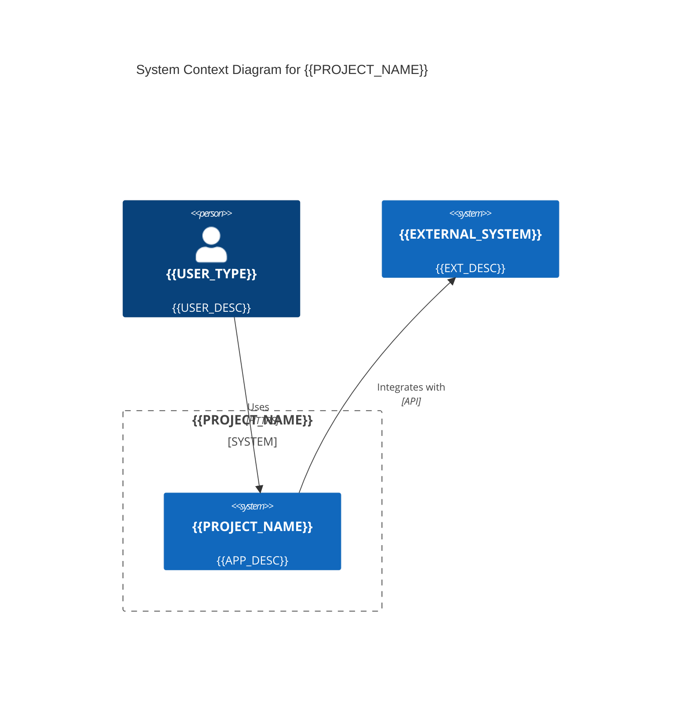
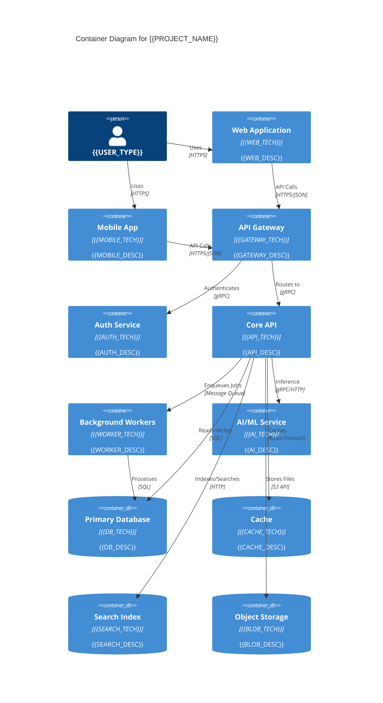
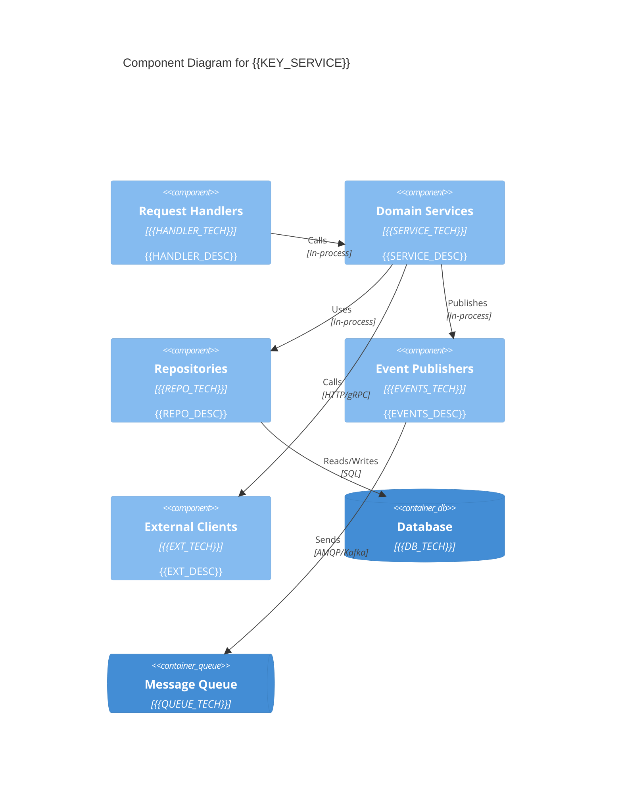
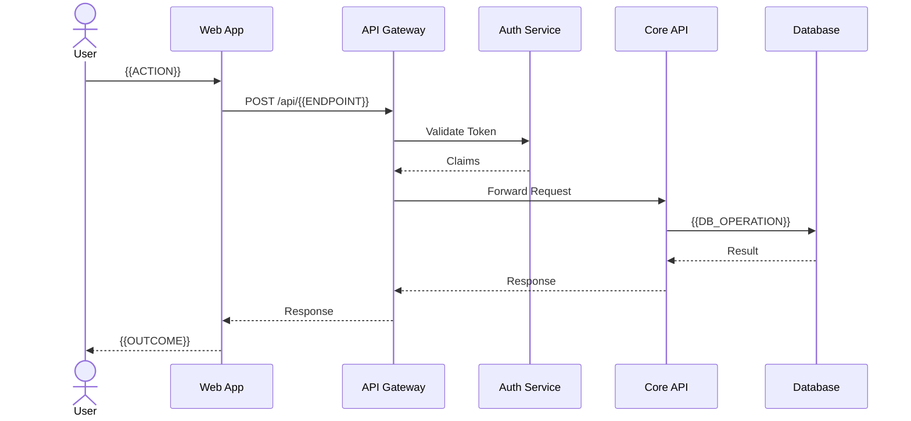
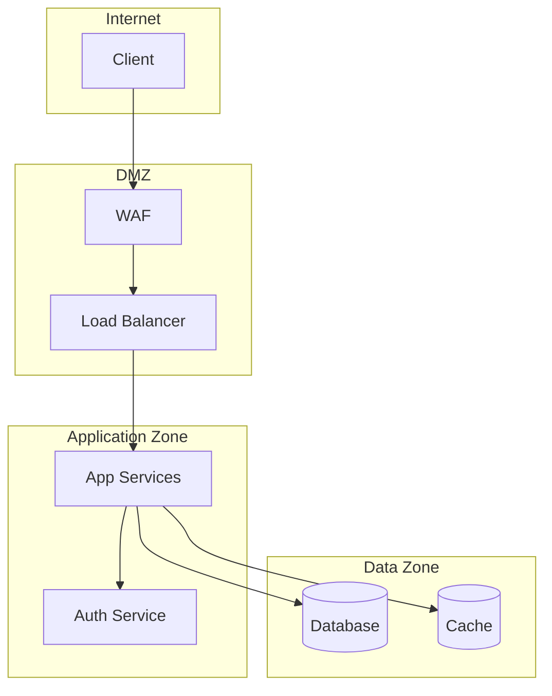
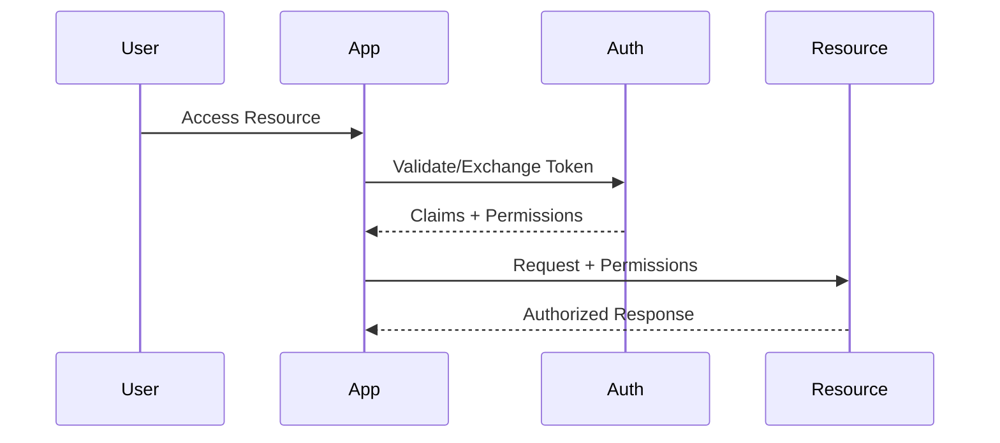
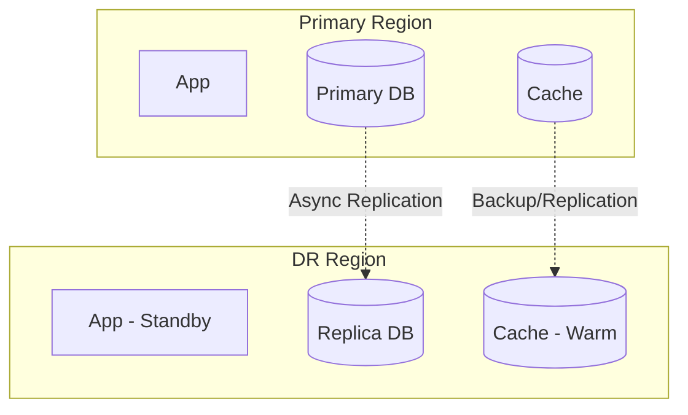

# Architecture Document: {{PROJECT_NAME}}

> **Version:** {{VERSION}}  
> **Status:** {{STATUS}}  
> **Author:** Solution Architect  
> **Last Updated:** {{DATE}}

---

## 1. Architectural Overview

### 1.1 Style & Patterns
| Aspect | Choice | Rationale |
|--------|--------|-----------|
| Architecture Style | {{STYLE}} (e.g., Microservices, Modular Monolith, Serverless) | {{RATIONALE}} |
| Communication | {{SYNC_ASYNC}} (REST, gRPC, Events, Messages) | {{RATIONALE}} |
| Data Management | {{DATA_PATTERN}} (Database per service, Shared DB, CQRS) | {{RATIONALE}} |
| Deployment | {{DEPLOY_PATTERN}} (Containers, Serverless, VMs) | {{RATIONALE}} |

### 1.2 Quality Attributes (Priority Order)
1. {{QA_1}} — {{QA_1_DETAIL}}
2. {{QA_2}} — {{QA_2_DETAIL}}
3. {{QA_3}} — {{QA_3_DETAIL}}

---

## 2. Context Diagram (C4 Level 1)



---

## 3. Container Diagram (C4 Level 2)



---

## 4. Component Diagram (C4 Level 3) — {{KEY_SERVICE}}



---

## 5. Sequence Diagrams — Key Flows

### 5.1 {{FLOW_NAME}}


---

## 6. Data Architecture

### 6.1 Database Design Decisions
| Decision | Choice | Rationale |
|----------|--------|-----------|
| Primary DB | {{DB_CHOICE}} | {{DB_RATIONALE}} |
| Schema Management | {{MIGRATION_TOOL}} | {{MIG_RATIONALE}} |
| Connection Pooling | {{POOLER}} | {{POOL_RATIONALE}} |
| Read Replicas | {{REPLICAS}} | {{REP_RATIONALE}} |

### 6.2 Entity Relationship Diagram
```mermaid
erDiagram
    {{ENTITY_1}} ||--o{ {{ENTITY_2}} : "{{RELATION_1}}"
    {{ENTITY_1}} {
        {{PK_1}} {{TYPE_1}} PK
        {{FIELD_1}} {{TYPE_2}}
        {{FIELD_2}} {{TYPE_3}}
    }
    {{ENTITY_2}} {
        {{PK_2}} {{TYPE_1}} PK
        {{FK_1}} {{TYPE_1}} FK
        {{FIELD_3}} {{TYPE_4}}
    }
```

### 6.3 Data Access Patterns
| Pattern | Implementation | Use Case |
|---------|---------------|----------|
| {{PATTERN_1}} | {{IMPL_1}} | {{USE_1}} |
| {{PATTERN_2}} | {{IMPL_2}} | {{USE_2}} |

---

## 7. Security Architecture

### 7.1 Trust Boundaries


### 7.2 Authentication & Authorization Flow


---

## 8. Infrastructure as Code Structure

```
infrastructure/
├── environments/
│   ├── development/
│   ├── staging/
│   └── production/
├── modules/
│   ├── networking/
│   ├── compute/
│   ├── data/
│   ├── security/
│   └── monitoring/
└── shared/
    ├── variables.tf
    └── outputs.tf
```

---

## 9. Deployment Topology

### 9.1 Kubernetes Resources (Example)
```yaml
# Reference: k8s/base/deployment.yaml
apiVersion: apps/v1
kind: Deployment
metadata:
  name: {{SERVICE_NAME}}
spec:
  replicas: {{REPLICAS}}
  selector:
    matchLabels:
      app: {{SERVICE_NAME}}
  template:
    metadata:
      labels:
        app: {{SERVICE_NAME}}
    spec:
      containers:
      - name: {{SERVICE_NAME}}
        image: {{IMAGE}}
        resources:
          requests:
            memory: "{{MEM_REQUEST}}"
            cpu: "{{CPU_REQUEST}}"
          limits:
            memory: "{{MEM_LIMIT}}"
            cpu: "{{CPU_LIMIT}}"
        envFrom:
        - secretRef:
            name: {{SERVICE_NAME}}-secrets
        - configMapRef:
            name: {{SERVICE_NAME}}-config
```

---

## 10. Observability Architecture

### 10.1 Metrics Pipeline
```
Application → Prometheus Exporter → Prometheus → Alertmanager → PagerDuty/Slack
                    ↓
              Grafana Dashboards
```

### 10.2 Logging Pipeline
```
Application → Structured Logs → Fluent Bit → Loki → Grafana
                                    ↓
                              Archive (S3/GCS)
```

### 10.3 Tracing Pipeline
```
Application → OpenTelemetry Collector → Tempo/Jaeger → Grafana
```

---

## 11. Disaster Recovery Architecture



| Scenario | RTO | RPO | Failover |
|----------|-----|-----|----------|
| Region Loss | {{RTO}} | {{RPO}} | {{FAILOVER_TYPE}} |

---

## 12. Cost Architecture

### 12.1 Cost Optimization Strategies
- {{STRATEGY_1}}
- {{STRATEGY_2}}
- {{STRATEGY_3}}

### 12.2 Estimated Monthly Cost Breakdown
| Component | Dev | Staging | Prod |
|-----------|-----|---------|------|
| Compute | ${{DEV_COMPUTE}} | ${{STAGE_COMPUTE}} | ${{PROD_COMPUTE}} |
| Database | ${{DEV_DB}} | ${{STAGE_DB}} | ${{PROD_DB}} |
| Storage | ${{DEV_STORAGE}} | ${{STAGE_STORAGE}} | ${{PROD_STORAGE}} |
| Network | ${{DEV_NET}} | ${{STAGE_NET}} | ${{PROD_NET}} |
| **Total** | **${{DEV_TOTAL}}** | **${{STAGE_TOTAL}}** | **${{PROD_TOTAL}}** |

---

## 13. Evolution & Extensibility

### 13.1 Extension Points
| Extension Point | Mechanism | Consumers |
|----------------|-----------|-----------|
| {{EXT_1}} | {{MECH_1}} | {{CONSUMERS_1}} |

### 13.2 Future Architecture Considerations
- {{FUTURE_1}}
- {{FUTURE_2}}

---

*Generated by AI Skill Engineer — Solution Architect Skill*