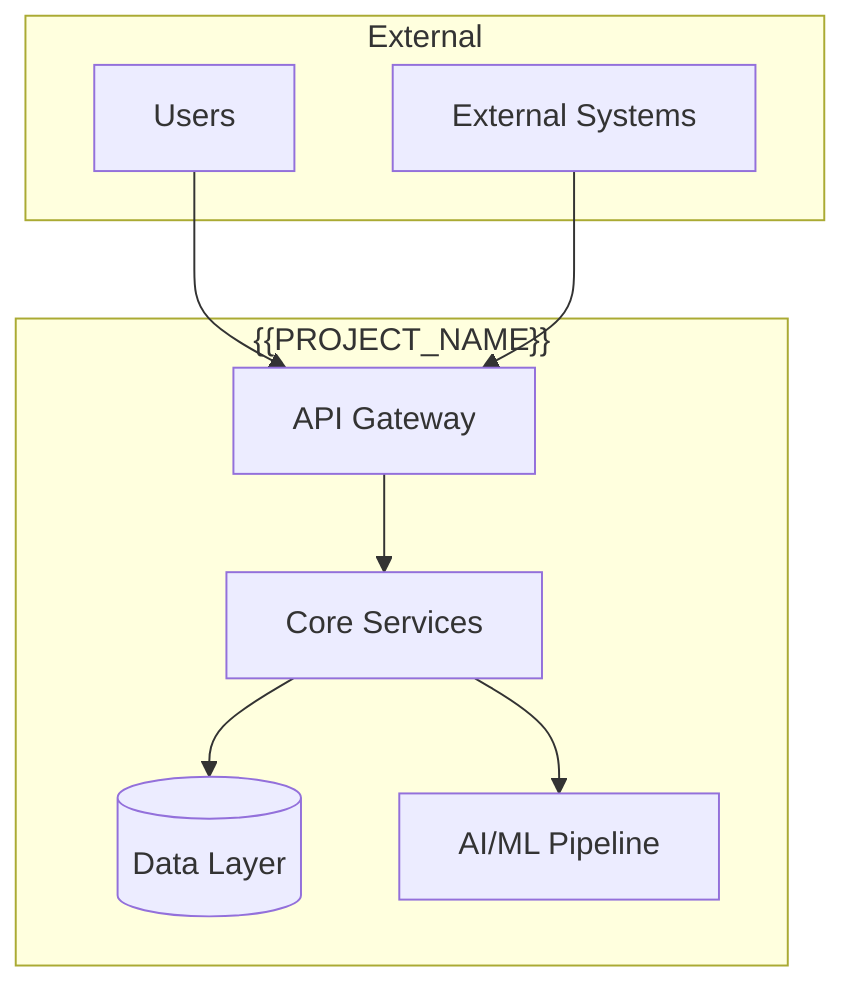
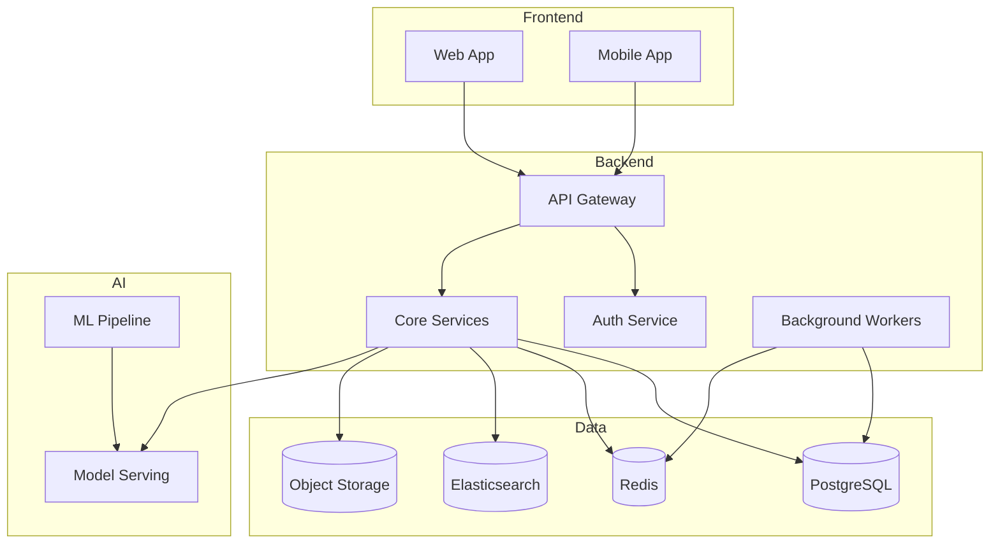
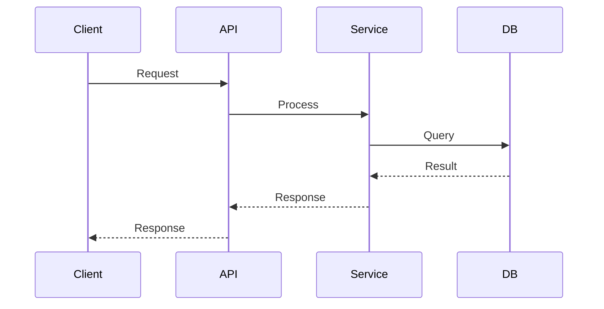
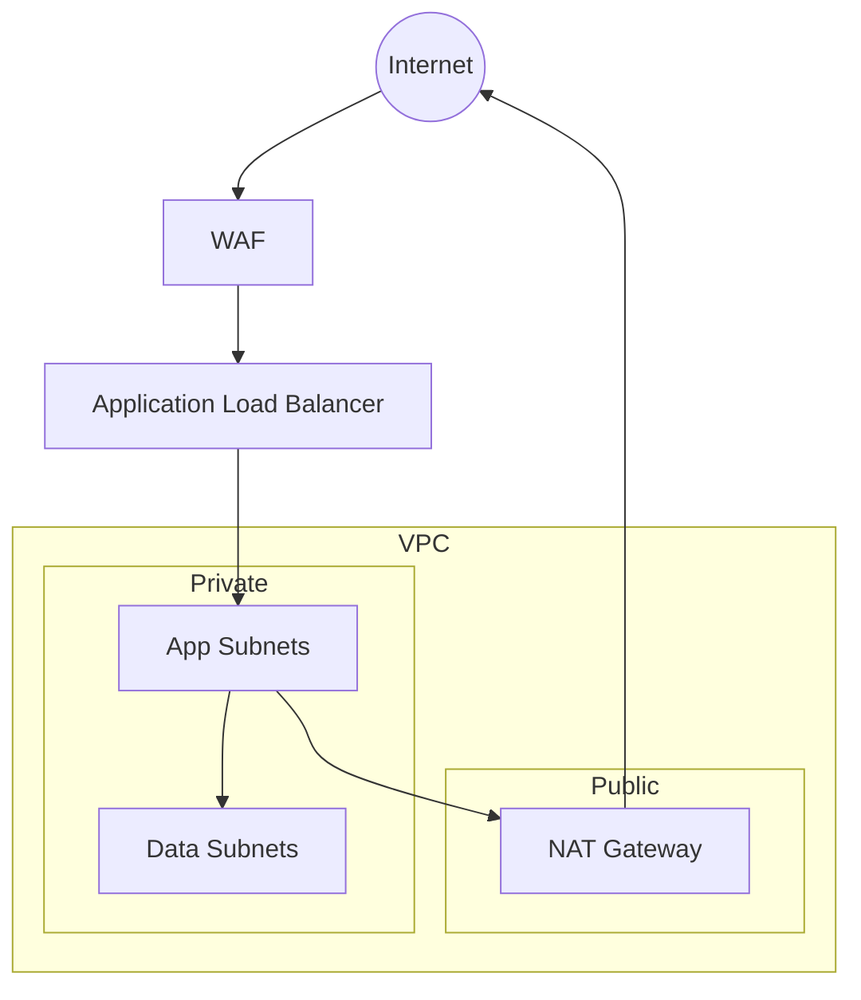
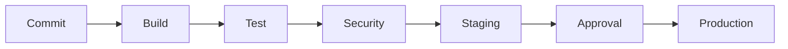

# Technical Specification: {{PROJECT_NAME}}

> **Version:** {{VERSION}}  
> **Status:** {{STATUS}}  
> **Author:** Solution Architect  
> **Reviewers:** {{REVIEWERS}}  
> **Last Updated:** {{DATE}}

---

## 1. Overview

### 1.1 Purpose
{{PURPOSE}}

### 1.2 Scope
{{SCOPE}}

### 1.3 Definitions & Acronyms
| Term | Definition |
|------|------------|
| {{TERM_1}} | {{DEF_1}} |
| {{TERM_2}} | {{DEF_2}} |

---

## 2. Architecture Decision Records (ADRs)

### ADR-{{NUMBER}}: {{TITLE}}
**Status:** {{ACCEPTED|PROPOSED|SUPERSEDED}}  
**Date:** {{DATE}}  
**Context:** {{CONTEXT}}  
**Decision:** {{DECISION}}  
**Consequences:** {{CONSEQUENCES}}  
**Alternatives Considered:** {{ALTERNATIVES}}

---

## 3. System Architecture

### 3.1 High-Level Architecture (C4 Level 1)


### 3.2 Container Architecture (C4 Level 2)


### 3.3 Component Architecture (C4 Level 3) — Key Services
| Service | Responsibility | Technology | Interfaces |
|---------|---------------|------------|------------|
| {{SVC_1}} | {{RESP_1}} | {{TECH_1}} | {{IFACE_1}} |
| {{SVC_2}} | {{RESP_2}} | {{TECH_2}} | {{IFACE_2}} |

---

## 4. API Specification

### 4.1 API Style
- **Protocol:** {{REST|GraphQL|gRPC|tRPC}}
- **Versioning:** {{URL|Header|Media Type}}
- **Authentication:** {{JWT|OAuth2|API Key|mTLS}}
- **Rate Limiting:** {{STRATEGY}}

### 4.2 Endpoints
| Method | Path | Description | Auth | Rate Limit |
|--------|------|-------------|------|------------|
| {{METHOD}} | {{PATH}} | {{DESC}} | {{AUTH}} | {{RL}} |

### 4.3 Data Models (OpenAPI 3.1)
```yaml
# Reference: openapi.yaml
components:
  schemas:
    {{MODEL_1}}:
      type: object
      properties:
        {{PROP_1}}:
          type: {{TYPE_1}}
        {{PROP_2}}:
          type: {{TYPE_2}}
```

---

## 5. Data Architecture

### 5.1 Conceptual Data Model
```mermaid
erDiagram
    {{ENTITY_1}} ||--o{ {{ENTITY_2}} : {{RELATION}}
    {{ENTITY_1}} {
        {{FIELD_1}} {{TYPE_1}} PK
        {{FIELD_2}} {{TYPE_2}}
    }
    {{ENTITY_2}} {
        {{FIELD_1}} {{TYPE_1}} PK
        {{FIELD_3}} {{TYPE_3}} FK
    }
```

### 5.2 Database Schema (PostgreSQL)
```sql
-- Reference: migrations/{{VERSION}}_initial_schema.sql
CREATE TABLE {{TABLE_1}} (
    {{COL_1}} {{TYPE_1}} PRIMARY KEY,
    {{COL_2}} {{TYPE_2}} NOT NULL,
    {{COL_3}} {{TYPE_3}} REFERENCES {{REF_TABLE}}({{REF_COL}})
);

CREATE INDEX {{INDEX_NAME}} ON {{TABLE_1}} ({{COL_2}});
```

### 5.3 Data Flow


### 5.4 Data Governance
| Aspect | Policy |
|--------|--------|
| Encryption at Rest | {{ENCRYPT_REST}} |
| Encryption in Transit | {{ENCRYPT_TRANSIT}} |
| PII Handling | {{PII_POLICY}} |
| Retention | {{RETENTION_POLICY}} |
| Backup | {{BACKUP_POLICY}} |

---

## 6. Infrastructure Architecture

### 6.1 Cloud Provider
- **Primary:** {{PROVIDER}} ({{REGION}})
- **Secondary:** {{SECONDARY_PROVIDER}} ({{SECONDARY_REGION}})

### 6.2 Network Topology


### 6.3 Compute
| Component | Type | Configuration | Scaling |
|-----------|------|---------------|---------|
| {{COMP_1}} | {{TYPE_1}} | {{CONFIG_1}} | {{SCALE_1}} |

### 6.4 Managed Services
| Service | Purpose | Configuration |
|---------|---------|---------------|
| {{SVC_1}} | {{PURPOSE_1}} | {{CONFIG_1}} |

---

## 7. Security Architecture

### 7.1 Threat Model (STRIDE)
| Threat | Mitigation | Status |
|--------|------------|--------|
| Spoofing | {{MIT_SPOOF}} | {{STATUS}} |
| Tampering | {{MIT_TAMPER}} | {{STATUS}} |
| Repudiation | {{MIT_REPUD}} | {{STATUS}} |
| Information Disclosure | {{MIT_INFO}} | {{STATUS}} |
| Denial of Service | {{MIT_DOS}} | {{STATUS}} |
| Elevation of Privilege | {{MIT_EOP}} | {{STATUS}} |

### 7.2 Security Controls
| Control | Implementation |
|---------|----------------|
| Authentication | {{AUTH_IMPL}} |
| Authorization | {{AUTHZ_IMPL}} (RBAC/ABAC) |
| Secrets Management | {{SECRETS_IMPL}} |
| Audit Logging | {{AUDIT_IMPL}} |
| Vulnerability Management | {{VULN_IMPL}} |

### 7.3 Compliance
| Standard | Scope | Evidence |
|----------|-------|----------|
| {{STD_1}} | {{SCOPE_1}} | {{EVIDENCE_1}} |

---

## 8. Observability

### 8.1 Metrics (RED + USE)
| Signal | Metrics | Target |
|--------|---------|--------|
| **Rate** | requests/sec | {{RATE_TARGET}} |
| **Errors** | error rate % | <{{ERROR_TARGET}}% |
| **Duration** | p50, p95, p99 latency | <{{LATENCY_TARGET}}ms |
| **Utilization** | CPU, Memory, Disk, Network | <{{UTIL_TARGET}}% |
| **Saturation** | Queue depth, connection pool | <{{SAT_TARGET}}% |

### 8.2 Logging
- **Format:** JSON (structured)
- **Levels:** ERROR, WARN, INFO, DEBUG
- **Correlation:** Request ID propagation
- **Retention:** {{RETENTION_DAYS}} days

### 8.3 Tracing
- **Sampling:** {{SAMPLING_RATE}}%
- **Context Propagation:** W3C TraceContext
- **Spans:** All external calls, DB queries, cache ops

### 8.4 Alerting
| Alert | Condition | Severity | Runbook |
|-------|-----------|----------|---------|
| {{ALERT_1}} | {{COND_1}} | {{SEV_1}} | {{RUNBOOK_1}} |

---

## 9. Deployment Architecture

### 9.1 Environments
| Environment | Purpose | Infrastructure | Data |
|-------------|---------|----------------|------|
| Development | Local dev | Docker Compose | Synthetic |
| Staging | Integration testing | Kubernetes (shared) | Anonymized prod subset |
| Production | Live traffic | Kubernetes (dedicated) | Production |

### 9.2 Deployment Strategy
- **Pattern:** {{BLUE_GREEN|CANARY|ROLLING}}
- **Rollback:** Automated on health check failure
- **Promotion:** Manual approval for Production

### 9.3 CI/CD Pipeline


---

## 10. Disaster Recovery

| Scenario | RTO | RPO | Strategy |
|----------|-----|-----|----------|
| Region Failure | {{RTO_1}} | {{RPO_1}} | {{STRAT_1}} |
| Data Corruption | {{RTO_2}} | {{RPO_2}} | {{STRAT_2}} |
| Ransomware | {{RTO_3}} | {{RPO_3}} | {{STRAT_3}} |

---

## 11. Cost Estimation

| Component | Monthly Cost (Est.) | Annual Cost |
|-----------|---------------------|-------------|
| {{COMP_1}} | ${{COST_1}} | ${{ANNUAL_1}} |
| **Total** | **${{TOTAL_MONTHLY}}** | **${{TOTAL_ANNUAL}}** |

---

## 12. Open Questions

| Question | Owner | Due | Decision |
|----------|-------|-----|----------|
| {{Q_1}} | {{OWN_1}} | {{DATE_1}} | {{DEC_1}} |

---

## 13. Approval

| Role | Name | Approved | Date |
|------|------|----------|------|
| Solution Architect | {{ARCH_NAME}} | | |
| Security Lead | {{SEC_NAME}} | | |
| Engineering Lead | {{ENG_NAME}} | | |